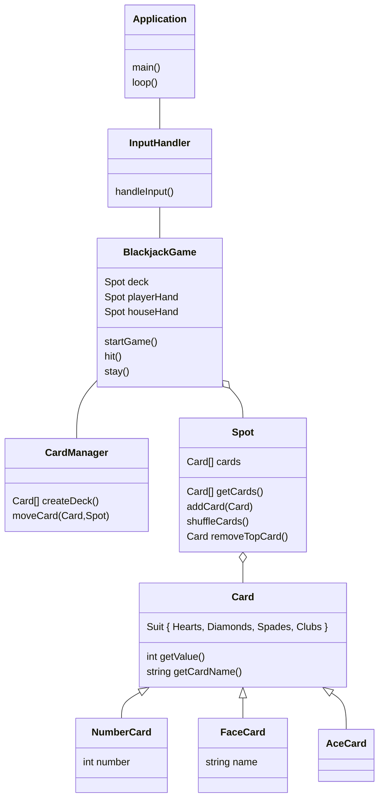

# Specialisterne Blackjack project
Simple C++ implementation of Blackjack

# UML diagram

# Building
- Install vcpkg and catch2
- Add env variable: `VCPKG_INCLUDE_PATH` (something like `C:/Users/~name~/.vcpkg-clion/vcpkg/installed/x64-mingw-dynamic/include`)