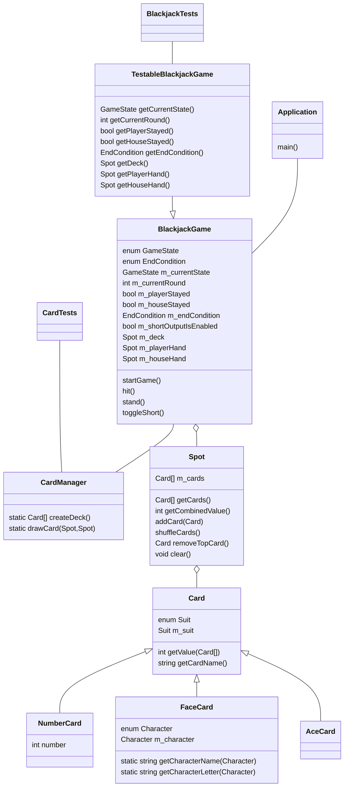

# Specialisterne Blackjack project
A simple C++ implementation of Blackjack as a console application.

# How to play
- After running the application, type `start` to begin a new game.
- You, as well as the "house" will be given two random cards each, but one of the house's cards will be hidden.
- Each card has a point value, and you will be able to see the total value of your current hand.
- If you type `hit`, you will draw another card, and if you type `stand`, you will proceed to the end of the game with your current hand.
- At the end of the game, if you are closer than the house to 21 points, you win. However, if you have more than 21 points, you will immediately lose the game.
- You can always start a new game with `start`, and typing `quit` will close the application.

## Card values
- Cards 2 to 10 are worth the same as their number.
- The face cards (Jack, Queen, King) are all worth 10.
- The ace is worth 11, unless that would make your hand exceed 21, then it's only worth 1.

## List of commands
| command | function |
|---|---|
| `start`  | start a new game |
| `hit` / `draw` | draw another card |
| `stand` / `stay` | stick with your current hand for the rest of the game |
| `quit` / `exit` | quit the application |
| `short` | toggle short representation of cards (e.g. `Q♥, A♠` instead of `Queen of Hearts, Ace of Spades` |

# Architecture
- The main class is responsible for handling input and passes it along to an instance of BlackjackGame.
- BlackjackGame handles the rules of the game and keeps track of the deck of cards and each player's hand.
- Spot is a container for cards and is either a hand or the deck of cards, but they are functionally identical.
- CardManager has static functions for creating a deck of cards and moving cards between different Spots.
- Card is an abstract class, so it is never instantiated, but it has three descendants. All Cards have a Suit.
- NumberCard can have a number from 2 to 10, and returns it from `getValue()`.
- FaceCard can have one of three Characters, but will always return 10 from `getValue()`.
- Ace card has no extra members, but utilises the `existingValue` parameter in `getValue()`.
- TestableBlackjackGame inherits from BlackjackGame and adds public functions that return its private members.
- BlackjackTests tests the BlackjackGame class and CardTests tests the Card classes.

## UML diagram

# Building the application (CLion)
- Install `catch2` and `fmt` (I used `vcpkg`)
- `.idea/cmake.xml` contains these env variables used by `CMakeLists.txt` to include the "standard" libraries in the build folder:
  - `LIB_GCC_NAME` = `libgcc_s_seh-1.dll`
  - `LIB_PTHREAD_NAME` = `libwinpthread-1.dll`
  - `LIB_STD_NAME` = `libstdc++-6.dll`
  - `MINGW64_BINARIES_PATH` = `$PROJECT_DIR$/../../../../Program Files/Git/mingw64/bin/`
  - If MingW64 is installed elsewhere, you'll have to change the binaries path.
  - If you're not using CLion you'll probably have to set them somewhere else.
  - Of course, if you're not using Windows, you don't have to worry about these .dlls.
