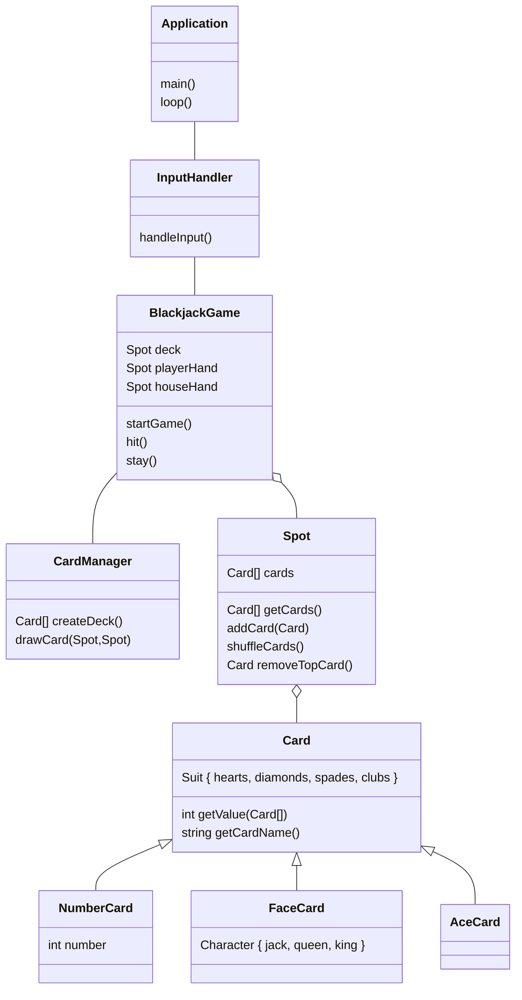

# Specialisterne Blackjack project
Simple C++ implementation of Blackjack

# UML diagram

# Building the application
- Install `catch2` and `fmt` (I used `vcpkg`)
- `.idea/cmake.xml` contains these env variables used by `CMakeLists.txt` to include the "standard" libraries in the build folder:
  - `LIB_GCC_NAME` = `libgcc_s_seh-1.dll`
  - `LIB_PTHREAD_NAME` = `libwinpthread-1.dll`
  - `LIB_STD_NAME` = `libstdc++-6.dll`
  - `MINGW64_BINARIES_PATH` = `$PROJECT_DIR$/../../../../Program Files/Git/mingw64/bin/`
  - If MingW64 is installed elsewhere, you'll have to change the binaries path.
  - If you're not using CLion you'll probably have to set them somewhere else.
  - Of course, if you're not using Windows, you don't have to worry about these .dlls.
